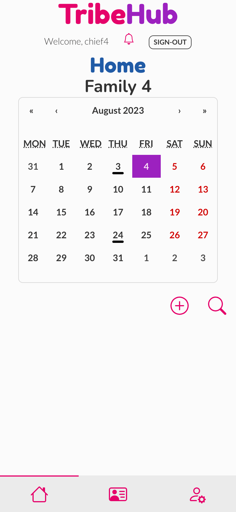
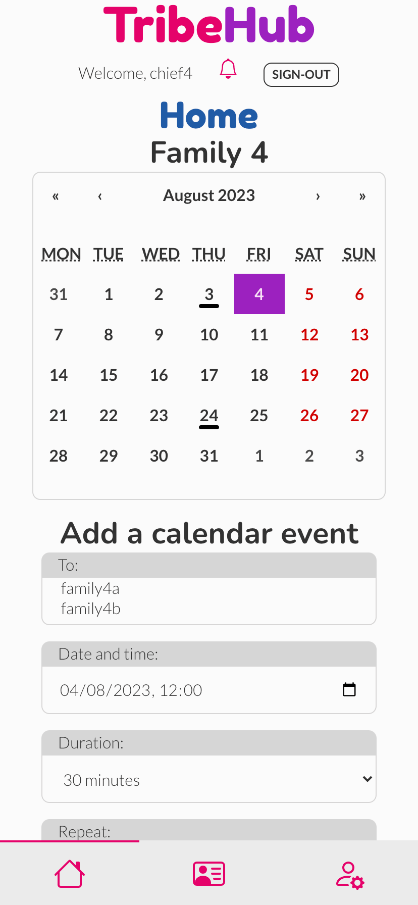
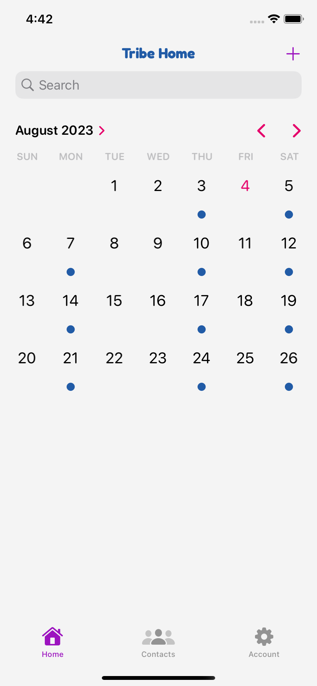
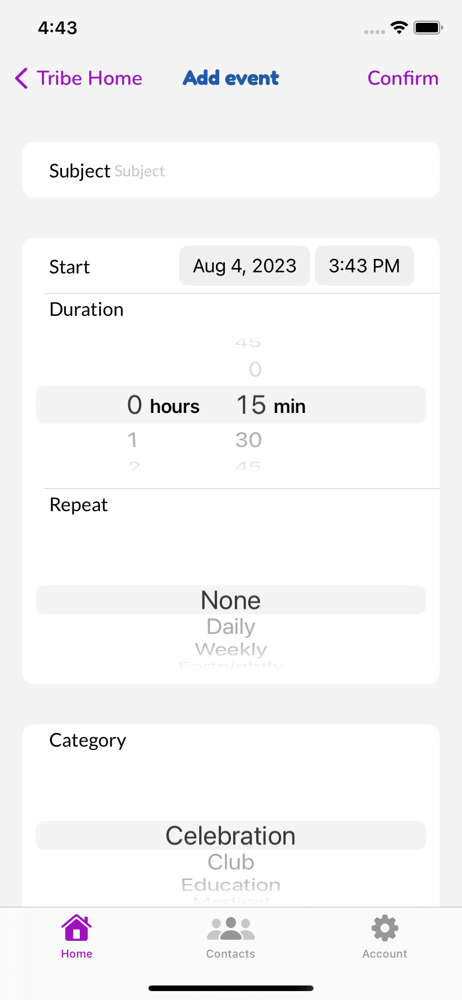
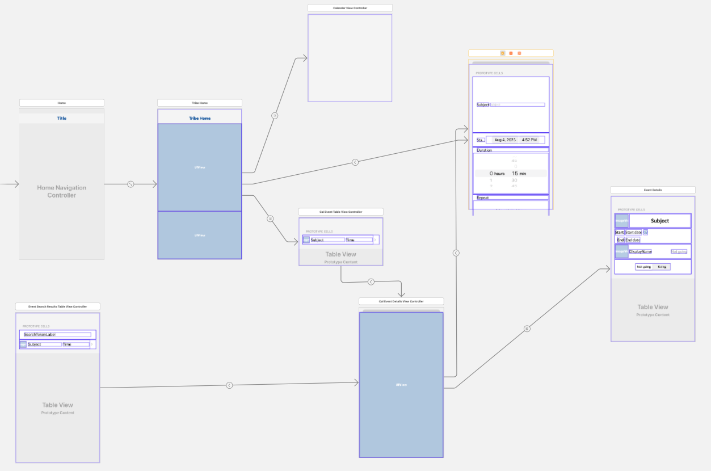
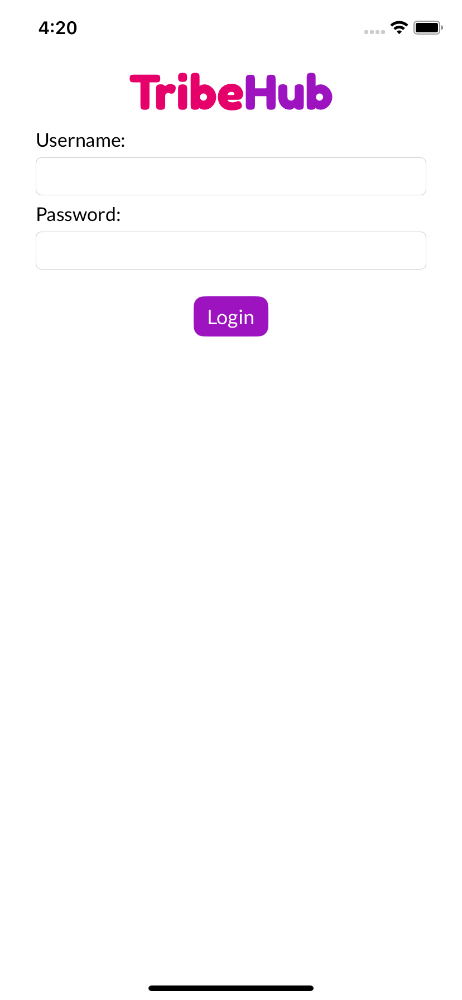
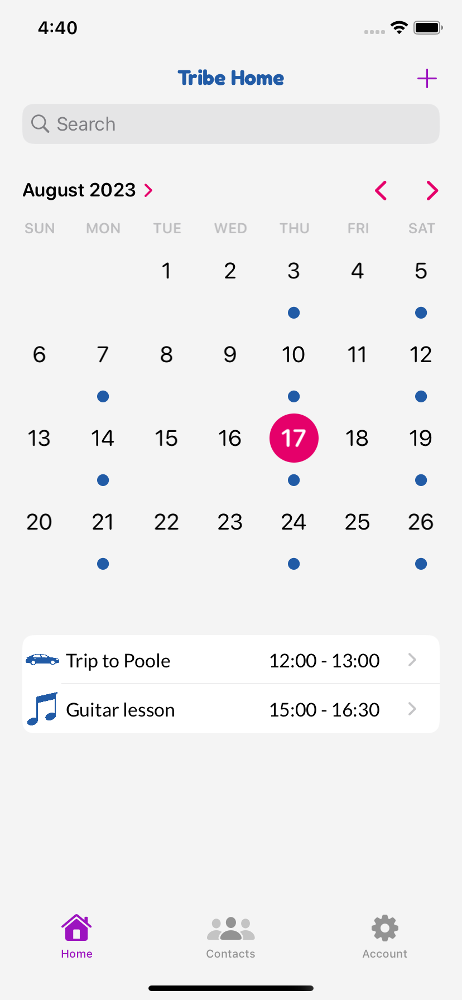
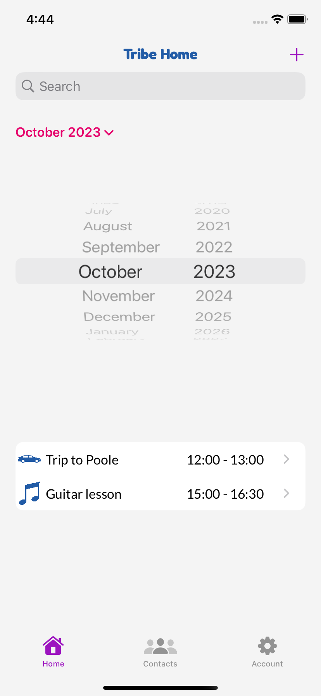

# TribeHub iOS
A native iOS app for the TribeHub family organiser, built using Swift and UIKit.
TribeHub iOS uses the [tribehub_drf](https://github.com/andy-guttridge/tribehub_drf) REST API for its backend.

## Project goals
TribeHub-iOS is designed to be a virtual equivalent to the typical wall planner a family might put up in a kitchen or communal area.
TribeHub was originally developed as a web app with a React frontend and a Django Rest Framework (DRF) backend.

The iOS version of the app is intended to provide iPhone users with all the functionality of the web app, packaged into a familiar native UI.
The project uses the same DRF backend as the React web app, so users can freely access and modify their data using both the native or web apps.

There are a few minor features of the web app not yet implemented in the iOS app, due to time restrictions and the need to modify the DRF backend to support them in a native app. These are detailed in the 'Future improvements and features' section below.

The primary goals of TribeHub are to:

1) Provide busy families with a single, central hub around which to plan and organise busy lives and schedules. This should include calendar/event scheduling functionality similar to a family wall planner, enabling events to be scheduled for one or multiple family members, and viewed by all the family.
2) Deliver a simple and intuitive user experience, suitable for adults and tech literate children aged 10+. 
3) Offer a minimal set of impactful features chosen in order to deliver a useful app within an achievable development timeframe, while laying a solid foundation for additional features in the future.

This is the repository for the native iOS TribeHub app.
The repository for the React web app is located [here](https://github.com/andy-guttridge/tribehub_react), and the Django Rest Framework backend repository is located [here](https://github.com/andy-guttridge/tribehub_drf).

## Table of contents

## User stories
TribeHub-iOS was developed by implementing the same themes, epics and user stories which were developed for the original web app. 
These are documented in a separate 'user_stories_ios' tab of this [Google Sheets document](https://docs.google.com/spreadsheets/d/11wcDHeqr85VaHXdJjATod_WECRY03IRUlGgT_L_ikIw/edit#gid=885440852).

### Themes
The themes developed at the beginning of the web app project - and also utilised for the iOS app - used the project goals as a starting point. These included:

- Account management - necessary to support the use of the app on an individual basis and to group users together into a 'tribe' to support goal 1.
- Calendar/event scheduling - essential to enable the key functionality required by goal 1.
- Family contacts - chosen as a feature with low implementation over-head to be included in an initial set of minimal functionality in support of goal 3.
- Shopping lists - chosen as a 'nice to have' feature which could be implemented for version 1 of the project given sufficient time, but which is also a discrete area of functionality which could be added later as per goal 3.
- Meal planning - also chosen as a 'nice to have' feature which could be added in a future version of the app, aligning with goal 3. This functionality would likely build on that of the shopping lists feature, and was therefore regarded as unlikely to be included in version 1.
- User feedback and information - required to support goal 2.
- Search and filter - required to support goal 2.

### Epics
Themes were then refined into the following epics:

- Account management
  - Account registration
  - Account sign-in
  - Account sign-out
  - Account deletion
  - User profile
- Calendar/event scheduling
  - Scheduling events
  - Event responses
  - Event deletion
  - Editing events
- Family contacts
  - Adding family contacts
  - Amending family contacts
  - Deleting family contacts
  - Viewing family contacts
- Shopping lists
  - Creating shopping lists
  - Amending shopping lists
  - Deleting shopping lists
- Meal planning
  - Creating a meal plan
  - Editing a meal plan
  - Deleting a meal plan
- User feedback/information
  - Notifications
  - User feedback
- Search and filter
  - Searching calendar events
  - Searching contact list
  - Searching shopping lists
  - Searching meal plans

### User stories
User stories required to implement each epic were created. These were categorised according to whether they were 'must have' features required to implement a Minimum Viable Product (MVP). Account registration was deemed a 'must have' for the web app, but was not included in the iOS app due to time constraints. A user can register a new account and create a new tribe as the 'tribe admin' using the web site (this action only needs to be performed once), and can then login and access all functionality from the app.

User stories involving notifications were not implemented for the iOS app, because to implement them in the same way as they were for the web app would not provide the type of user experience an iOS user would expect from a native app. It would instead be desirable to use Apple's [User Notifications API](https://developer.apple.com/documentation/usernotifications), however this would require significant changes to the Django Rest Framework API, which were out of scope for the initial iteration of this project. This would be a high priority for future improvements.

Please see the [Google sheet](https://docs.google.com/spreadsheets/d/11wcDHeqr85VaHXdJjATod_WECRY03IRUlGgT_L_ikIw/edit#gid=885440852) for detail of the user stories implemented and tested for the iOS app.

## Planning
The wireframes originally created for development of the TribeHub web app and the web app itself were used as a 'template' for all required functionality for the iOS implementation and as a model for the basic 'flow' through the app.

The DaisyUI and custom UI components of the web app were replaced with native classes from Apple's UIKit framework. Rather than replicate the web UI, the iOS UI was implemented quite differently in order to provide a user experience familiar for iOS users. 

For example, where the web app typically reveals a form with cancel and submit buttons within the main body of the web page, the iOS app segues to a different view with a form comprised of a `UITableView` with appropriate input components embedded within `UITableViewCell`s, and 'back' and 'Confirm' buttons in the `UINavigationBar` at the top of the app. Using this type of UI is instinctive for any regular iOS user.

    
    
    

  <i>Example of before and after opening an 'inline' form with 'cancel' and 'submit' buttons in web app</i>

    
    

  <i>Example of same form presented as a separate view with 'back' and 'confirm' buttons in iOS app</i>

Instead of creating new wireframe mockups for iOS, the UI was built directly using storyboards in XCode's interface builder, as this enables the developer to visually assemble the UI  in the IDE.

    

  <i>Example of TribeHub UI storyboard</i>

## Data models
Data models were planned alongside the wireframes used to develop the original web app. These are documented in the read-me for the [TribeHub Django Rest Framework API](https://github.com/andy-guttridge/tribehub_drf).

## Design

### Colours
The colours used in the iOS app are largely the same as those used in the web app, although they are used slightly differently for iOS. A full explanation of the colour choices is provided in the [read-me](https://github.com/andy-guttridge/tribehub_react) for the web app. Three Apple system colours were additionally used to provide visual feedback for some elements, and colours were tweaked to provide sufficient contrast in dark mode.

The colour palettes used for light and dark modes are:

| Colour                                                                                | Light mode value  | Dark mode value |
|---------------------------------------------------------------------------------------|-------------------|-----------------|
| THAccent - NavBar titles, calendar decorations, event category and repeat event icons | #215BA6           | #a3c4ff         |
| THBackground - neutral background color for all views                                 | #f4f4f4           | #000000         |
| THCaution - sign-out icon                                                             | systemOrangeColor | systemOrangeColor|
| THGreyed - unselected icons, user 'not going' legends                                 | systemGrayColor   | #b3b3b9         |
| THHighlight - delete account icon, some calendar UI, logo                             | #e5006a           | #ee5880         |
| THIcons - interactive UI elements (e.g. icons, buttons), event owner legends          | #9c13bf           | #b05fbf         |
| THPositive - add item icons, user 'going' legends                                     | systemMintColor   | SystemMintColor |

### Fonts
The same Google Fonts were used for the iOS app as for the web app - Nunito, Lato and Fredoka. More detail on why these were chosen is available in the [read-me](https://github.com/andy-guttridge/tribehub_react) for the web app.

Fredoka was used for the TribeHub logo on the login view and the Navigation Bar titles at the top of each view.
Nunito was used for the UIBarButtonItems (buttons appearing in the Navigation Bar such as back, confirm and edit buttons etc).
Lato was used for standard text in the app.

## Features

### Log-in view
Provides the user with a simple form to login, and a TribeHub logo that will be familiar to anyone who has already used the web app.

    

### Tab Bar
Provides a means to navigate between the three main views of the app. The tab bar appears at the bottom of the screen and is a standard UI element familiar to iOS users.

    

### Navigation Bar
Provides a means of navigating between sub-views within each main view, and presents the user with buttons to enter edit mode and confirm edit actions when appropriate. When in edit mode, the user can discard an edit by simply pressing the back button to return to the previous view. This is a different approach than that used in the web app, which typically uses modal dialogs with 'cancel' and 'confirm' buttons, but provides a user experience familiar to iOS users.

The example screen shots show the navigation bar with a button to edit an existing event, and to confirm edits to an event.

    
        
    

### Home view with family calendar
The Home view features the family calendar - this is the virtual equivalent of a kitchen wall planner. Days with meetings/appointmens ('calendar events') are marked with a calendar decoration underneath the date. The user can select a given day to see a TableView with a list of events for that day underneath the calendar.
The user can select the month or year of their choice using the drop down arrow to the right of the month and year name, and move forward or back one month at a time using the buttons at the top right of the calendar.

Users can tap each event underneath the calendar to reveal more details about the event, and to edit the event if they are the event owner and/or tribe admin.

    
        
    

### Add event button

### Events search bar

### Event detail view

### Event edit button with change and delete options

### Add event view

### Edit event view

### Family contacts view

### Add contact button

### Contacts search bar

### Add contact view

### Contact edit and delete buttons

### Edit contact view

### Account view

#### Manage tribe view

#### Display name view

#### Password view

#### Delete account and sign-out

### Alerts to confirm or cancel destructive actions and display errors
**Note different approach for deletion of contacts and tribe members**

### Dark mode

### CRUD functionality

## Future improvements and features
### High priority

- It was not possible to fully implement username and password autofill on the login view, due to requiring a paid Apple developer account to be able to use ['Associated Domains'](https://developer.apple.com/documentation/xcode/supporting-associated-domains). This would be a priority feature for a commerical version of the app.
- It is not currently possible to edit or delete a calendar event from the search results view, because Apple's searchController API presents a searchResultsController modally, which means the Edit button navigationItem is not shown. Implementing this feature would require some additional customisation of the search functionality, which was not possible due to time restrictions, but would be prioritised for a commercial version of the app.
- Account registration
- Notifications

### Longer term future features
- iPad compatibility
- Mac compatibility

## Frameworks, libraries and dependencies
- UIKit
- SFSymbols
- Alamofire

## Testing

## Unresolved bugs and issues

## Building the app

## Credits
- Ideas for managing network requests using protocols from https://matteomanferdini.com/network-requests-rest-apis-ios-swift/
- Ideas for using model controllers to manage persistent data from https://code.tutsplus.com/tutorials/the-right-way-to-share-state-between-swift-view-controllers--cms-28474
- Article on how to use combine to observe changes to properties in a UIKit app from https://www.swiftbysundell.com/articles/published-properties-in-swift/
- Code for adding a loading spinner view adapted from https://www.hackingwithswift.com/example-code/uikit/how-to-use-uiactivityindicatorview-to-show-a-spinner-when-work-is-happening
- The technique for obtaining every day of a month from a Calender object is from https://www.hackingwithswift.com/example-code/uikit/how-to-use-uiactivityindicatorview-to-show-a-spinner-when-work-is-happening
- Code to create an image from a string is from https://stackoverflow.com/questions/51100121/how-to-generate-an-uiimage-from-custom-text-in-swift
** Do we still need imageFromString()? **
- The technique to extend UIImageView to make a rounded image is from https://stackoverflow.com/questions/28074679/how-to-set-image-in-circle-in-swift
- Code to make a grey scale copy of an image is from https://stackoverflow.com/questions/35959378/how-can-i-temporarily-grey-out-my-uiimage-in-swift
- Code to resize an image is from https://stackoverflow.com/questions/31966885/resize-uiimage-to-200x200pt-px
- The technique for using a custom dateDecodingStrategy with a DateFormatter matching the API's date format is from https://stackoverflow.com/questions/50847139/error-decoding-date-with-swift
