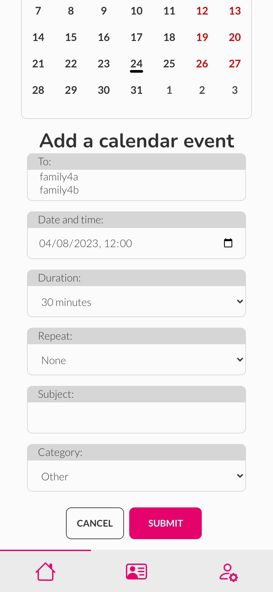
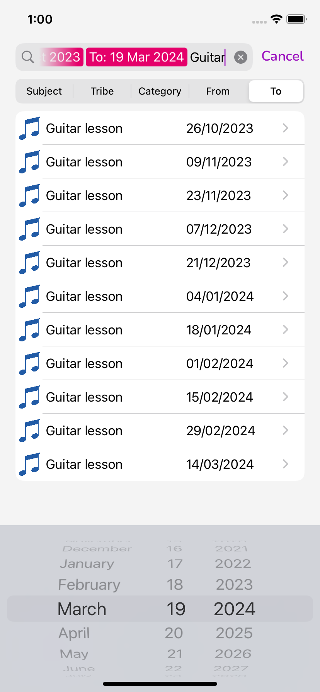
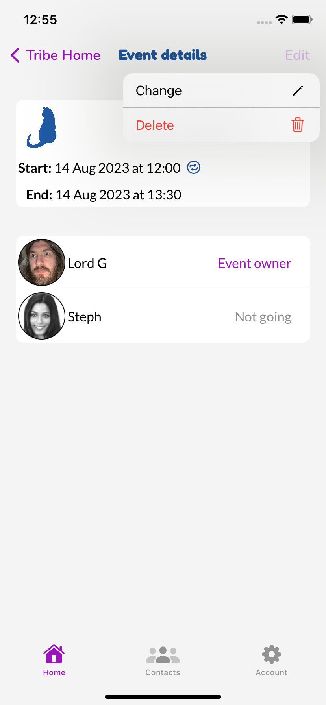
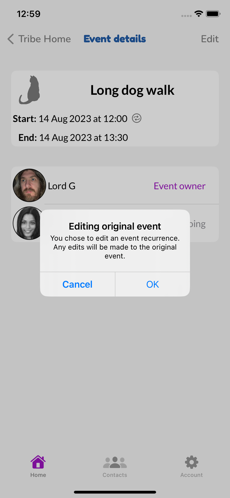
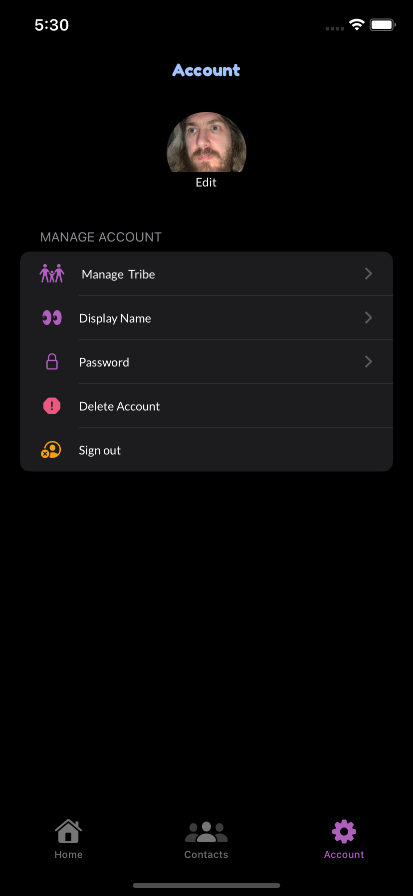

# TribeHub iOS
A native iOS app for the TribeHub family organiser, built using Swift and UIKit.
TribeHub iOS uses the [tribehub_drf](https://github.com/andy-guttridge/tribehub_drf) REST API for its backend.

## Project goals
TribeHub-iOS is designed to be a virtual equivalent to the typical wall planner a family might put up in a kitchen or communal area.
TribeHub was originally developed as a web app with a React frontend and a Django Rest Framework (DRF) backend.

The iOS version of the app is intended to provide iPhone users with all the functionality of the web app, packaged into a familiar native UI.
The project uses the same DRF backend as the React web app, so users can freely access and modify their data using both the native or web apps.

There are a few minor features of the web app not yet implemented in the iOS app, due to time restrictions and the need to modify the DRF backend to support them in a native app. These are detailed in the 'Future improvements and features' section below.

The primary goals of TribeHub are to:

1) Provide busy families with a single, central hub around which to plan and organise busy lives and schedules. This should include calendar/event scheduling functionality similar to a family wall planner, enabling events to be scheduled for one or multiple family members, and viewed by all the family.
2) Deliver a simple and intuitive user experience, suitable for adults and tech literate children aged 10+. 
3) Offer a minimal set of impactful features chosen in order to deliver a useful app within an achievable development timeframe, while laying a solid foundation for additional features in the future.

This is the repository for the native iOS TribeHub app.
The repository for the React web app is located [here](https://github.com/andy-guttridge/tribehub_react), and the Django Rest Framework backend repository is located [here](https://github.com/andy-guttridge/tribehub_drf).

## Table of contents

## User stories
TribeHub-iOS was developed by implementing the same themes, epics and user stories which were developed for the original web app. 
These are documented in a separate 'user_stories_ios' tab of this [Google Sheets document](https://docs.google.com/spreadsheets/d/11wcDHeqr85VaHXdJjATod_WECRY03IRUlGgT_L_ikIw/edit#gid=885440852).

### Themes
The themes developed at the beginning of the web app project - and also utilised for the iOS app - used the project goals as a starting point. These included:

- Account management - necessary to support the use of the app on an individual basis and to group users together into a 'tribe' to support goal 1.
- Calendar/event scheduling - essential to enable the key functionality required by goal 1.
- Family contacts - chosen as a feature with low implementation over-head to be included in an initial set of minimal functionality in support of goal 3.
- Shopping lists - chosen as a 'nice to have' feature which could be implemented for version 1 of the project given sufficient time, but which is also a discrete area of functionality which could be added later as per goal 3.
- Meal planning - also chosen as a 'nice to have' feature which could be added in a future version of the app, aligning with goal 3. This functionality would likely build on that of the shopping lists feature, and was therefore regarded as unlikely to be included in version 1.
- User feedback and information - required to support goal 2.
- Search and filter - required to support goal 2.

### Epics
Themes were then refined into the following epics:

- Account management
  - Account registration
  - Account sign-in
  - Account sign-out
  - Account deletion
  - User profile
- Calendar/event scheduling
  - Scheduling events
  - Event responses
  - Event deletion
  - Editing events
- Family contacts
  - Adding family contacts
  - Amending family contacts
  - Deleting family contacts
  - Viewing family contacts
- Shopping lists
  - Creating shopping lists
  - Amending shopping lists
  - Deleting shopping lists
- Meal planning
  - Creating a meal plan
  - Editing a meal plan
  - Deleting a meal plan
- User feedback/information
  - Notifications
  - User feedback
- Search and filter
  - Searching calendar events
  - Searching contact list
  - Searching shopping lists
  - Searching meal plans

### User stories
User stories required to implement each epic were created. These were categorised according to whether they were 'must have' features required to implement a Minimum Viable Product (MVP). Account registration was deemed a 'must have' for the web app, but was not included in the iOS app due to time constraints. A user can register a new account and create a new tribe as the 'tribe admin' using the web site (this action only needs to be performed once), and can then login and access all functionality from the app.

User stories involving notifications were not implemented for the iOS app, because to implement them in the same way as they were for the web app would not provide the type of user experience an iOS user would expect from a native app. It would instead be desirable to use Apple's [User Notifications API](https://developer.apple.com/documentation/usernotifications), however this would require significant changes to the Django Rest Framework API, which were out of scope for the initial iteration of this project. This would be a high priority for future improvements.

Please see the [Google sheet](https://docs.google.com/spreadsheets/d/11wcDHeqr85VaHXdJjATod_WECRY03IRUlGgT_L_ikIw/edit#gid=885440852) for detail of the user stories implemented and tested for the iOS app.

## Planning
The wireframes originally created for development of the TribeHub web app and the web app itself were used as a 'template' for all required functionality for the iOS implementation and as a model for the basic 'flow' through the app.

The DaisyUI and custom UI components of the web app were replaced with native classes from Apple's UIKit framework. Rather than replicate the web UI, the iOS UI was implemented quite differently in order to provide a user experience familiar for iOS users. 

For example, where the web app typically reveals a form with cancel and submit buttons within the main body of the web page, the iOS app segues to a different view with a form comprised of a `UITableView` with appropriate input components embedded within `UITableViewCell`s, and 'back' and 'Confirm' buttons in the `UINavigationBar` at the top of the app. Using this type of UI is instinctive for any regular iOS user.

    
    
    

  <i>Example of before and after opening an 'inline' form with 'cancel' and 'submit' buttons in web app</i>

    
    

  <i>Example of same form presented as a separate view with 'back' and 'confirm' buttons in iOS app</i>

Instead of creating new wireframe mockups for iOS, the UI was built directly using storyboards in XCode's interface builder, as this enables the developer to visually assemble the UI  in the IDE.

    

  <i>Example of TribeHub UI storyboard</i>

## Data models
Data models were planned alongside the wireframes used to develop the original web app. These are documented in the read-me for the [TribeHub Django Rest Framework API](https://github.com/andy-guttridge/tribehub_drf).

## Design

### Colours
The colours used in the iOS app are largely the same as those used in the web app, although they are used slightly differently for iOS. A full explanation of the colour choices is provided in the [read-me](https://github.com/andy-guttridge/tribehub_react) for the web app. Three Apple system colours were additionally used to provide visual feedback for some elements, and colours were tweaked to provide sufficient contrast in dark mode.

The colour palettes used for light and dark modes are:

| Colour                                                                                | Light mode value  | Dark mode value |
|---------------------------------------------------------------------------------------|-------------------|-----------------|
| THAccent - NavBar titles, calendar decorations, event category and repeat event icons | #215BA6           | #a3c4ff         |
| THBackground - neutral background color for all views                                 | #f4f4f4           | #000000         |
| THCaution - sign-out icon                                                             | systemOrangeColor | systemOrangeColor|
| THGreyed - unselected icons, user 'not going' legends                                 | systemGrayColor   | #b3b3b9         |
| THHighlight - delete account icon, some calendar UI, logo                             | #e5006a           | #ee5880         |
| THIcons - interactive UI elements (e.g. icons, buttons), event owner legends          | #9c13bf           | #b05fbf         |
| THPositive - add item icons, user 'going' legends                                     | systemMintColor   | SystemMintColor |

### Fonts
The same Google Fonts were used for the iOS app as for the web app - Nunito, Lato and Fredoka. More detail on why these were chosen is available in the [read-me](https://github.com/andy-guttridge/tribehub_react) for the web app.

Fredoka was used for the TribeHub logo on the login view and the Navigation Bar titles at the top of each view.
Nunito was used for the UIBarButtonItems (buttons appearing in the Navigation Bar such as back, confirm and edit buttons etc).
Lato was used for standard text in the app.

## Features

### Log-in view
Provides the user with a simple form to login, and a TribeHub logo that will be familiar to anyone who has already used the web app.

    

### Tab Bar
Provides a means to navigate between the three main views of the app. The tab bar appears at the bottom of the screen and is a standard UI element familiar to iOS users.

    

### Navigation Bar
Provides a means of navigating between sub-views within each main view, and presents the user with buttons to enter edit mode and confirm edit actions when appropriate. When in edit mode, the user can discard an edit by simply pressing the back button to return to the previous view. This is a different approach than that used in the web app, which typically uses modal dialogs with 'cancel' and 'confirm' buttons, but provides a user experience familiar to iOS users.

The example screen shots show the navigation bar with a button to edit an existing event, and to confirm edits to an event.

    
    
    

### Home view with family calendar
The Home view features the family calendar - this is the virtual equivalent of a kitchen wall planner. Days with meetings/appointmens ('calendar events') are marked with a calendar decoration underneath the date. The user can select a given day to see a TableView with a list of events for that day underneath the calendar.
The user can select the month or year of their choice using the drop down arrow to the right of the month and year name, and move forward or back one month at a time using the buttons at the top right of the calendar.

    
    
    

### Add event button
The add event button appears on the right hand side of the navbar in the home view. The button uses the standard + symbol familar to iOS users.
The button navigates to the 'add event' view, and enables the authenticated user to add a new event for their tribe.

    

### Events search bar with scope buttons and search tokens

    

Custom behaviour was implemented for Apple's scope buttons and search tokens to provide an intuitive UI for searching on multiple event fields.
When the user initially selects the search bar, 'subject', 'tribe', 'category', 'from' and 'to' scope buttons appear:

    

The behaviour of each button is as follows:

- Subject - the user can enter free text into the search bar, which is used to query event subjects:

    

- Tribe - the user is presented with a list of members of their tribe. Selecting a tribe member creates a search token in the search bar, and that the search query is narrowed down to only include events involving that tribe member. Multiple tribe members can be selected and added to the search query.

    

- Category - the user is presented with a list of possible event categories. Selecting a category creates a search token in the search bar and narrows the search query down to only include events with that category. Only one category search token is allowed at one time, because the Django Rest Framework backend does not support searching on multiple categories. Any exsiting category search tokens are replaced when a new category is selected.

    

- From - the user is presented with a UIDatePicker. Selecting a date creates a new 'from' search token and limits the search query to only include events after that date. If a 'to' search token is already present and the user selects a 'from' date after the 'to' date, a search token is not created.

    

- To - works in the same way as the 'from' scope button, and limits the search query to only include events up until the selected date. If a 'from' search token is already present and the user selects a 'to' date before the 'from' date, a search token is not created.

    

The user can delete search tokens from the search bar in the same way as deleting free text using the on screen keyboard, which in turn results in that item being removed from the search query.

This customised use of scope buttons and search tokens provides a much more compact and intuitive approach to searching on multiple fields than the web app, which uses a large form to capture search terms for each field.

Search results are displayed below the search bar when the user is not choosing from the 'tribe' or 'category' lists. The list of event search results automatically reappears after the user has made a tribe member or category selection.

### Event detail view
Users can view the details of an event by selecting the relevant cell underneath the calendar or from the search results.

    

### Event edit button with change and delete options
If the user is the owner of the event or the tribe admin, an edit button is available in the event detail view.
Pressing the button reveals a drop-down menu, offering options to edit or delete the event.

If the user is not the owner of the event or the tribe admin, no edit button appears.

    
    
    

### Add event view
The add event view is accessed by pressing the + button in the tribe home view. It enables a user to enter the details for a new event. It includes appropriate 'picker' UI elements for the start date, duration, repeat and category fields.
Other tribe members can optionally be invited to the event by selecting them from the table at the bottom of this view. 

The user can save the event to the database using the 'confirm' button, or cancel the creation of the new event by pressing the 'Tribe Home' back button (this is the same approach used in many of Apple's views in the iOS settings app).

    
    
    

### Edit event view
The edit event view is accessed by pressing the 'change' option from the 'edit' button dropdown menu in the event details view.
This view is identical to add event, except that it is pre-populated with the details of the event being edited.

Note that if the user selects to edit an event recurrence, an alert is displayed to inform them that any edits will be made to the original event and give the option to cancel the action. This is similar behaviour to the web app.

    
    
    
    
    

### Family contacts view
The family contacts view displays a list of contacts for the family. These can be viewed by all members of the tribe, and only the tribe admin can add, edit or delete contacts.

    

### Add contact button
The add contact 'button' is actually a UITableViewCell, and can be seen in the screenshot above. This is only available to the tribe admin, and simply does not appear if the user does not have admin status.

### Contacts search bar and search results
The contacts search bar is much simpler than the events search bar. It allows the user to perform a simple textual search on all contact fields.
Search results are displayed directly below the search bar.

    

### Add contact view
The add contact view enables the tribe admin to complete a simple form to add a new family contact.
The 'confirm' button saves the new contact to the database, while the 'contacts' back button simply returns the user to the main contacts view without saving.

    

### Contact edit and delete buttons
Pressing the 'edit' button in the contacts view puts the contacts table into edit mode.
This exposes a red delete button to the left of each contact table view cell, and a 'disclosure indicator' accessory to the right of the cell (indicating to the user that selecting the cell leads to a view with further detail). 

If the user selects the delete button on the left, the cell slides to the left and reveals a second delete button. Pressing the second button confirms the delete action, and the contact is deleted from the database and removed from the contacts table.

If the user selects a contact cell while in edit mode (other than pressing the delete button), the app presents the edit contact view.

Pressing the 'done' button in the nav bar exits edit mode and returns the table to normal (no delete buttons and disclosure indicators).

Edit and delete actions are only available to the tribe admin.

    
    
    

### Edit contact view
The edit contact view is the same as add contact, except that the form is prepopulated with the contact details.
The user can confirm the edit action or return to the previous view without saving any changes in the usual way.

    

### Account view
The account view enables the user to manage their user profile and account.

    

#### Profile image
Pressing the edit button on the profile image in the Account view enables the user to choose a picture from their photo library or to take a new picture with the device camera.
The ability to use a picture directly from the camera is a significant enhancement over the web app. If the user chooses the camera option, the picture is uploaded to the user profile and is not saved to the photo library on the device - this behaviour could be changed if users demanded it.

    
    
    
    
    

#### Manage tribe view
The manage tribe view is only available to the tribe admin (the option is greyed out and unselectable for non-admins). It allows the tribe admin to add new members of the tribe, and delete existing ones.

Pressing the Add tribe member tableViewCell opens the add tribe member view (see below).

Pressing the Edit button in the nav bar shows a red delete button against each tribe member. Selecting the delete button reveals a second delete button to the right of the tableViewCell, and then pressing that causes the tribe member to be permanently deleted from the tribe and their account closed. The user can abort the delete action by pressing the screen somewhere away from the second delete button, or pressing the Done button.

    
    
    
    
    

#### Add tribe member view
This view enables the tribe admin to add a new tribe member by entering a user name and password (the new tribe member can change their own password later).

    

#### Display name view
Enables the user to change their display name.

    

#### Password view
Enables the user to change their password.

    

#### Delete account and sign-out
The delete account option displays an action sheet to confirm whether the user really does wish to delete their account. If the user confirms, their account is made inactive in the database, their profile deleted, and any events they have created are also deleted. 

If the user deleting the account is the tribe admin, all user accounts associated with the tribe are made inactive, all their profiles deleted and all other data associated with the tribe is deleted. This action effectively 'shuts down' the whole tribe. Tribe admin users are presented with a specific warning of this in the confirm/cancel action sheet.

The sign-out option simply signs the user out of their account.

    
    
    

### Error alerts
The TribeHub iOS app includes error alerts which are presented in the event a create, update or delete action fails (including data validation errors received from the REST API) and if there are any issues fetching data. A sample of error messages is shown below (these do not include every single permutation).

    
    
    
    
    
    
    
    
    
    
    
    
    

### Dark mode
TribeHub iOS features a dark mode which is activated according to the user's system settings.

    
    
    
    
    
    
    
    
    

### CRUD functionality
TribeHub iOS features full Create, Read, Update and Delete functionality, via the UI implemented using Apple's UIKit framework, Alamofire networking library and the Django Rest Framework API.

- Create - users can register a new user account as a tribe administrator, and then create further user accounts for their tribe members. Tribe administrators can create contacts, and all authenticated users can create calendar events for their tribe.
- Read - authenticated users can view their tribe's contacts and calendar events, and their profile image and display name. Tribe administrators can also view a list of all their tribe members.
- Update - authenticated users can update their profile image, display name and password, and edit and save calendar events they have created. Additionally, tribe administrators can edit contacts and all calendar events for the tribe.
- Delete - authenticated users can delete calendar events they have created, and their user profiles. Tribe administrators can delete all calendar events, contacts, and user profiles. 

## Future improvements and features
### High priority

- It was not possible to fully implement username and password autofill on the login view, due to requiring a paid Apple developer account to be able to use ['Associated Domains'](https://developer.apple.com/documentation/xcode/supporting-associated-domains). This would be a priority feature for a commerical version of the app.
- It is not currently possible to edit or delete a calendar event from the search results view, because Apple's searchController API presents a searchResultsController modally, which means the Edit button navigationItem is not shown. Implementing this feature would require some additional customisation of the search functionality, which was not possible due to time restrictions, but would be prioritised for a commercial version of the app.
- Account registration - this was not implemented due to time constraints. Users can use the web app to register a new account as a tribe admin, and then login into the iOS app. It is likely the registration features would need to be implemented differently for commerical distribution via the app store in any case (e.g. allowing users to register from the app using their Apple ID). 
- Notifications - notifications were not implemented in the iOS app due to time constraints. The approach used in the React web app would not provide an experience that would meet the expectations of iOS users. Apple's user notifications API would be used instead, however this would require additional work in the DRF backend, which was out of scope for this project. However, this would be a priority feature for future development.
- Password strength checking for all accounts - the custom Django Rest Framework code that enables tribe administrators to create additional user accounts for tribe members does not currently 'hook in' to Django's built-in checks for password strength.
- Reassign ownership of events created by deleted users - currently events are deleted if the user who created them deletes their account. This avoids any issues with 'orphaned' instances in the database, but a better solution would be to automatically or optionally transfer ownership of such events to the tribe administrator.
- Transfer of tribe admin status to another user - in the event a tribe administrator closes their account, all user accounts associated with the tribe are closed and data deleted. This is to prevent 'orphaned' tribes and tribe members with no administrator. A better solution would be to enable the transfer of tribe admin status to another user.
- All day calendar events.
- A 'no reply' default event response status - currently each user can only have an 'accepted' or 'not accepted' status for each calendar event, with the default being 'not accepted'. This means that while users can actively accept an invitation, they cannot actively decline. This is acceptable for a first iteration of a minimum viable product, but a better user experience would be for the default status to be neutral, so that a user can either actively accept or decline.

### Longer term future features
- iPad compatibility, including a UI tailored to the larger iPad screen.
- Mac compatibility, including a UI tailored to the Mac (probably using the Catalyst API).
- Refactoring the events data format to adopt the iCal standard, as a first step towards implementing integration with external calendars such as Gmail etc.
- End dates/date ranges for repeat events (e.g. 'repeat weekly until 1 December 2023').
- Exceptions to repeat event rules (e.g. a user could set up an event to recur weekly every Wednesday, but could create an exception so that one recurrence is on a Thursday).
- Exceptions to 'accept/decline' responses for recurrences (e.g. the user could accept all recurrences and then decline them on an individual basis).
- Notifications to remind users of events ahead of time and push notifications.
- Day/week/year views for the calendar.
- Shopping lists and items, integrated with the calendar system.
- Meal plans, intregrated into shopping lists.
- UI improvements, e.g. an avatar based UI for inviting tribe members to events, enabling proper display of long contact names.

## Frameworks, libraries and dependencies
- Apple's [UIKit framework](https://developer.apple.com/documentation/uikit/) was used for the UI.
- Apple's [SFSymbols](https://developer.apple.com/sf-symbols/) were used for the app icons.
- The [Alamofire](https://github.com/Alamofire/Alamofire/blob/master/Documentation/Usage.md#using-alamofire) library was used to implement the networking layer, including features such as request retriers.

## Testing
Manual tests were devised for each user story to be implemented for the project. 
These were performed on builds of the app deployed both to the Xcode iOS simulator on the Mac and to real iPhone XR and iPhone SE devices. The tests and their outcomes are documented on the user_stories_ios tab of the [TribeHub user stories spreadsheet](https://docs.google.com/spreadsheets/d/11wcDHeqr85VaHXdJjATod_WECRY03IRUlGgT_L_ikIw/edit#gid=885440852).

In addition, builds of the app were deployed to both the iOS simulator and real devices and subject to continual user testing throughout the development process. 

## Unresolved bugs and issues
- When details some details of an event are edited and saved (e.g. changing the event subject), any members of the tribe who had been invited to the event are removed and need to be readded.
- It is currently not possible to edit an event when details are viewed from search results, because the default search results view controller behaviour presents the search results as a modal without a navbar and therefore no edit button. This was not fixed due to time constraints but would be a high priority for future development.
- Event owner's are not currently included in search results using the 'tribe' search tokens. The most efficient fix would be a change to the behaviour of the Djano Rest Framework backend. Development of the DRF backend was out of scope for this project, but could easily be fixed in the future.
- The app does not currently handle very long strings in some of the textFields in the contacts table very well, for example in the screenshot below, the label for the category field at the top as expanded vertically to show the whole of the long string, however the first name field also contains a very long string which has been truncated. This is due to the use of horizontal stack views to position labels of variable horizontal sizes on the same 'row' with the correct spacing. Solutions considered including enabling touch interaction for those labels, to expose a popover or modal view containing the whole text, but this was not implemented due to time issues. In practice, the available space should be sufficient for most real-world contact details.

## Building the app
These instructions will allow you to build and run the app using the XCode iOS simulator, or to build and run on a real iOS device. You must have an Apple Mac capabale of running XCode 14 to follow these instructions.

- If you don't already have the XCode IDE installed, download and install from [Apple's website](https://developer.apple.com/xcode/) or the Mac app store. You must install XCode version 14 or above to build TribeHub-iOS.
- You must also install the [Cocoapods dependency manager](https://cocoapods.org). You should be able to install this by opening the terminal app on your Mac, and typing `sudo gem install cocoapods`. If you encounter any issues, refer to the [Cocoapods trouble shooting guide](https://guides.cocoapods.org/using/troubleshooting#installing-cocoapods).
- Clone this Git repository to your local machine:
    - Open the terminal app, and navigate to the directory where you wish to clone the repoository using `cd [path-to-directory]`.
    - Clone this repo by typing `git clone https://github.com/andy-guttridge/tribehub_ios [name-of-folder-you-wish-to-clone-to]`. For example, `git clone https://github.com/andy-guttridge/tribehub_ios tribe-hub-ios-clone` would clone the repository into a directory called `tribe-hub-ios-clone`.
- Enter the directory containing your repo in the terminal using `cd [path-to-repo]`, for example `cd tribe-hub-ios-clone`.
- Install the dependencies using cocoapods by typing `pod install` in the terminal.
    - If the installation was successful, you will see green `Installing Alamofire (5.6.4)` and `Pod installation complete! There is 1 dependency from the Podfile and 1 total pod installed` messages in the terminal. You may also see some warnings - these can be safely ignored. 
- You can now build and run the project in XCode
    - 

## Credits
- Ideas for managing network requests using protocols from https://matteomanferdini.com/network-requests-rest-apis-ios-swift/
- Ideas for using model controllers to manage persistent data from https://code.tutsplus.com/tutorials/the-right-way-to-share-state-between-swift-view-controllers--cms-28474
- Article on how to use combine to observe changes to properties in a UIKit app from https://www.swiftbysundell.com/articles/published-properties-in-swift/
- Code for adding a loading spinner view adapted from https://www.hackingwithswift.com/example-code/uikit/how-to-use-uiactivityindicatorview-to-show-a-spinner-when-work-is-happening
- The technique for obtaining every day of a month from a Calender object is from https://www.hackingwithswift.com/example-code/uikit/how-to-use-uiactivityindicatorview-to-show-a-spinner-when-work-is-happening
- Code to create an image from a string is from https://stackoverflow.com/questions/51100121/how-to-generate-an-uiimage-from-custom-text-in-swift
- The technique to extend UIImageView to make a rounded image is from https://stackoverflow.com/questions/28074679/how-to-set-image-in-circle-in-swift
- Code to make a grey scale copy of an image is from https://stackoverflow.com/questions/35959378/how-can-i-temporarily-grey-out-my-uiimage-in-swift
- Code to resize an image is from https://stackoverflow.com/questions/31966885/resize-uiimage-to-250x250pt-px
- The technique for using a custom dateDecodingStrategy with a DateFormatter matching the API's date format is from https://stackoverflow.com/questions/50847139/error-decoding-date-with-swift
